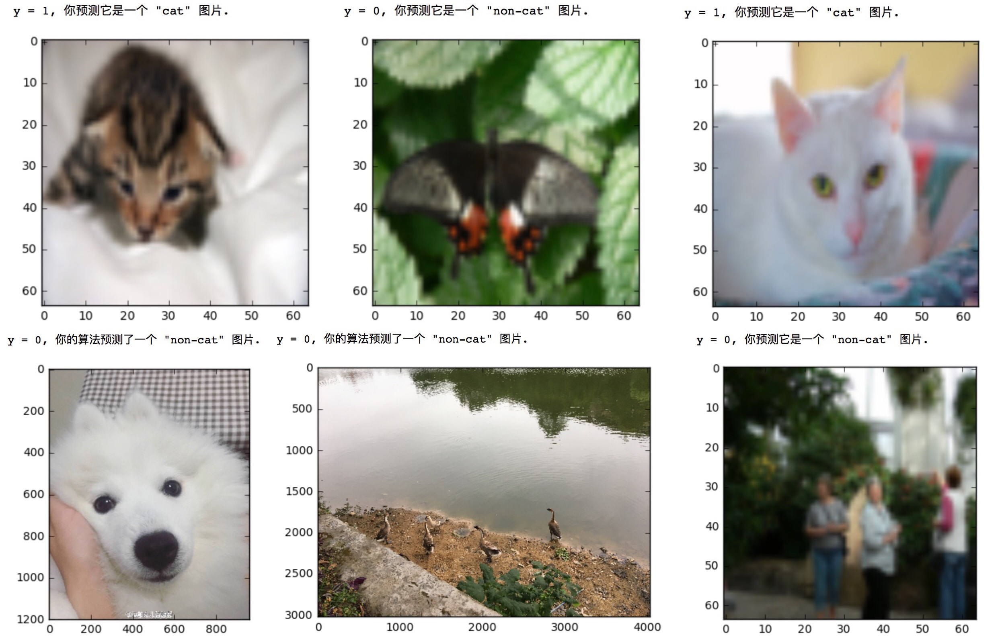

# cat-vs-non-cat

同样是利用cat-vs-non-cat数据集，在第一次作业中，只使用一个Logistic层实现了70%的测试准确率。在这个作业项目中将构造深度神经网络模型，来增加模型的复杂度，提高预测准确率。在Deep_Neural_Network_Model.ipynb中实现了DNN的各个函数模块，在Model_Application.ipynb中调用Deep_Neural_Network_Model.ipynb的各个函数模块构造DNN，对cat-vs-non-cat数据集进行训练预测。

**`Deep_Neural_Network_Model.ipynb` 结构如下：**

* 初始化Weight, bias
* Forward propagation
  * 构造[linear->relu]×（L-1）->linear->sigmoid的前向传播模型
* Cost function
* Backward propagation
  * 构造[linear->relu]×（L-1）->linear->sigmoid的前向传播模型
  * 更新权重，偏差
 ### Model_Application.ipynb机构如下：
* 构造两层神经网络模型，隐藏层7个神经网络单元，2500次迭代后，Test Accuracy=0.72
* 构造五层神经网络模型，各层神经网络单元为[12288, 20, 7, 5, 1]， 2500次迭代后，Test Accuracy=0.80

## 使用自己的训练集

